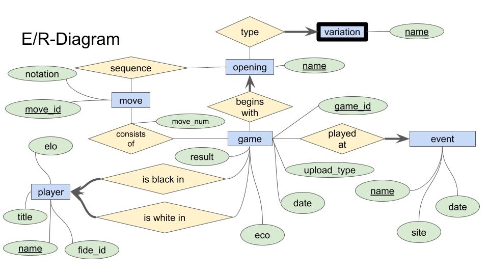

# DIS-Project

### E/R Model


# How to Compile the Web App

## Requirements
Run the code below in your terminal to install the necessary modules to compile the web app.

```
pip install -r requirements.txt
```

* Make sure that your Postgres server is configured as follows and turned on:

| Host      | Port |
|-----------|------|
| localhost | 5432 |

Run

```
cp .env.example .env
```

Insert your username and password to postgres in `.env`


Then you can initialize the database with (if `python3` does not work replace it with `python`):

```
python3 init.py
```

Then you can compile the web app and start the database by running the command:

```
python3 run.py
```

# Tutorial on the Web App

The web app is built up of several underlying sites, each with different implementations and use cases within the web app.

## _Home_
The home site serves as the navigational hub for the other sites. You can access the subsites from the menu or directly from the URL by entering the name of the page. The URLs are case-sensitive, so remember to use lowercase.

For example, to navigate to the search page, enter:
```
http://127.0.0.1:5000/search
```

To access the home page, the endpoint path is just `/`.

## _Search_
Here, it is possible to search the database for games using the name of a player and a sequence of moves in the given player's game. Both search requirements use regex matching (for player names in `PostgreSQL`; for sequence of moves, with the Python module `re`). This means that it is possible to search through the database for all players if no player name is supplied since the empty string regex matches all player names in this context.

It is also possible to search for similar games to a given game ID using the second search button. This uses an LCS-solver module in Python to find how similar games are. A single game is returned (if the database has more than one game in the collection).

## _Upload_
Here, you can upload your own chess games to the DIScover Chess database. The app supports either Portable Game Notation files (.pgn) or a link to a file from the website [PGN Mentor](https://www.pgnmentor.com/files.html).

If you have a [chess.com](https://www.chess.com) account, you can download a PGN file from the website and upload your own games to DIScover Chess!

## _About_
This site contains a small section with information about this project.

## _Search_
Here, it is possible to search the database for games using the name of a player and a sequence of moves in the given players game. Both search-requirements uses regex-mathing (for player-names: in postresql; for sequence of moves, with Python module 're'). This means that it is possible to search through the database for all players, if no player-name is supplied, since the empty string regex-matches all player names in this context.

It is also possible to search for similar games to a given game ID using the second search button. This uses a LCS-solver module in Python to find how similar games are. A single game is returned (if the database has more than one game in the collection).

### _Comparing games_
After you have searched for a `gameID` in the database, you can compare the two games that are most similar. The games are compared via their opening, and you can see their stats such as where, when, and who played the match. Additionally, you can see how the two games unfolded with their moves. There is currently no way to look up a specific game's `gameID` before searching for similar games.
